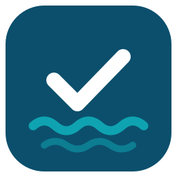
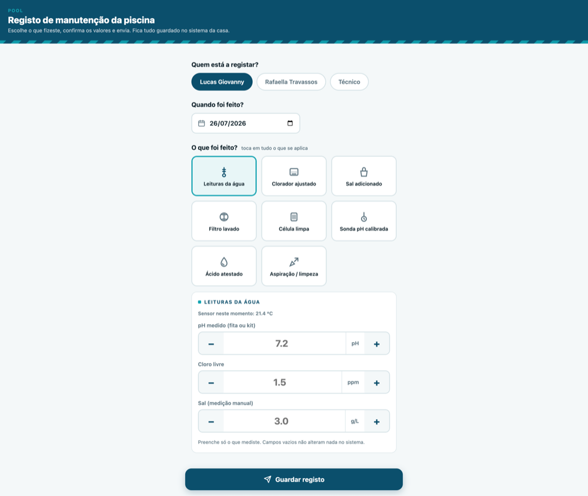
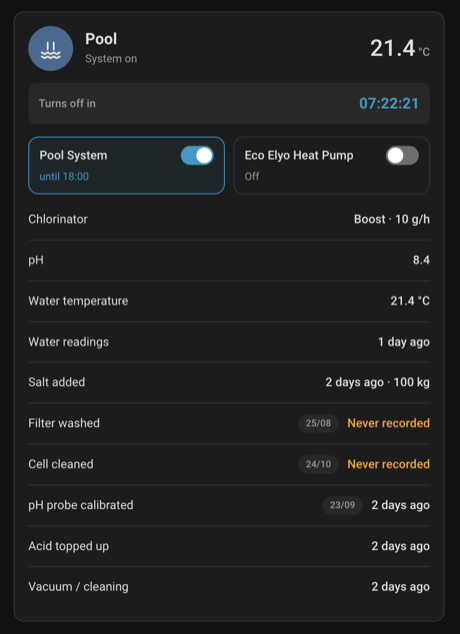
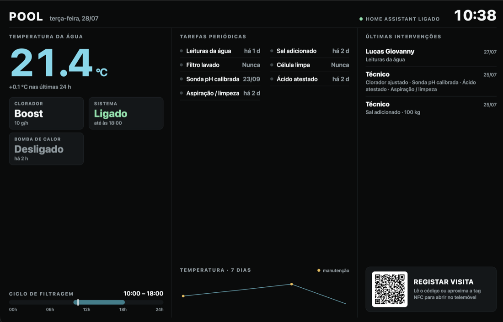
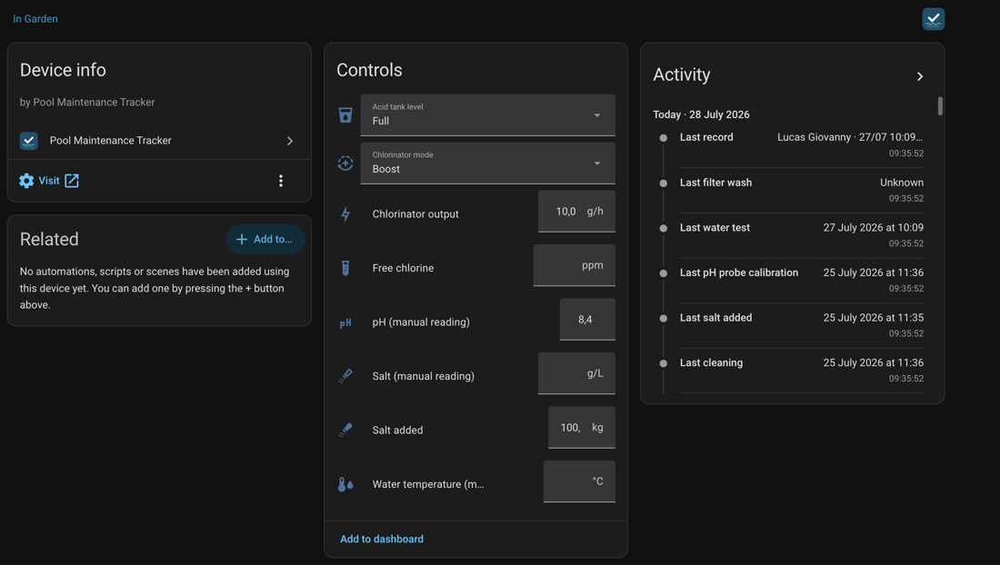
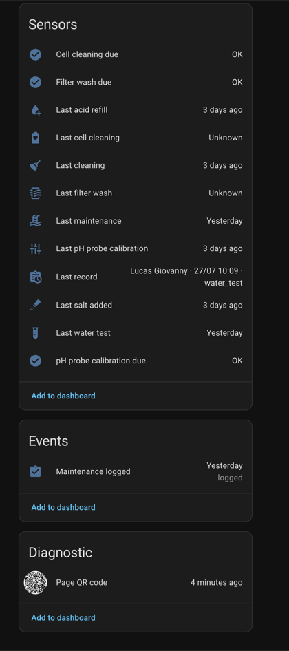

<p align="center">
  
</p>

<h1 align="center">Pool Maintenance Tracker</h1>

<p align="center">
  A Home Assistant integration that tracks pool maintenance through a public,
  mobile-first web page — opened from a QR code or NFC tag in your pool's machine room —
  plus a dashboard card and a wall dashboard for the screen next to the pool.
  <br><br>
  <a href="https://github.com/lucasgiovanny/pool-maintenance-tracker/actions/workflows/ci.yml"></a>
  <a href="https://github.com/lucasgiovanny/pool-maintenance-tracker/actions/workflows/validate.yml"></a>
  <a href="https://github.com/lucasgiovanny/pool-maintenance-tracker/releases"></a>
  
</p>

---

Whoever maintains the pool — you, family, or an external technician — scans a tag,
taps what they did (washed the filter, added salt, measured pH…), and hits save.
No Home Assistant login, no app. The integration turns those submissions into
native HA entities, keeps a persistent maintenance log, and reminds you when
periodic tasks are overdue.

## How it works

1. The integration serves a self-contained web page at a non-guessable URL
   (`/api/pool_maintenance_tracker/<token>/page`).
2. You write that URL to an NFC tag or print the QR code (both are provided as
   entities) and stick it in the machine room.
3. Anyone who opens the page picks who they are, optionally adjusts the date
   and time (defaults to now), taps the maintenance tiles, fills in readings,
   and submits — works fine on mobile data.
4. The integration validates the submission, updates the entities, fires an
   event for your automations, appends to the log, and sends notifications
   when something needs attention.

The pool is then visible in three places: the **web page** (for whoever is
standing at the pool), a **dashboard card** inside Home Assistant, and an
optional **wall dashboard** for a screen in the machine room.

## The web page

The page adapts to your pool: tiles and entities exist only for the equipment
you actually have. It has up to three tabs.

<p align="center">
  
</p>

**Log** — who is logging, when it was done, what was done, the values measured,
and an optional note.

**Status** (optional, on by default) — gives whoever maintains the pool, even
without HA access, a read-only overview: current values, periodic tasks with
their next due date and overdue badges, your equipment, the notes diary and the
recent maintenance history. Toggle it under **Configure → Page and
notifications**.

**History** — charts the pool over time (7 days / 30 days / 6 months):

- **Water readings** — daily averages from the linked probes (HA long-term
  statistics) as a line, with your manual readings overlaid as dots.
- **Equipment** — daily averages for numeric entities, and *hours on per day*
  bars for on/off entities (computed from the HA recorder history, so limited
  by your recorder retention — 10 days by default).

Charts are lightweight inline SVG — no external libraries, still one
self-contained page.

### Maintenance mode

A maintenance visit: *somebody is working on this pool right now*, this is what
the equipment should do while they are, and this is when it ends. It is on by
default and lives in four places — as `switch.<pool>_maintenance_mode` in Home
Assistant, as a toggle at the top of the maintenance page (so the technician
can start a visit from their phone, no HA account needed), on the dashboard
card, and as a header pill on the wall dashboard, which states it either way:
quiet when off, amber when on. Don't want any of it? Turn it off under
**Configure → Pool → Maintenance mode switch** and the entity and every toggle
go away with it.

#### The visit: what should happen, and for how long

Working on a pool usually means the equipment has to be somewhere in
particular — the system off while the filter is open, the heat pump on for a
while. So on the page the toggle opens a sheet instead of just flipping:

- **one row per piece of equipment** you assigned under **Configure →
  Equipment**, with its state right now and three choices: *no change*, *turn
  on*, *turn off* (a cover gets *open* / *close*). Roles left on *no change*
  are never touched, and roles that cannot be commanded — a schedule helper, a
  role pointed at a `binary_sensor` — are not offered at all.
- **for how long**: 30 min, 1 h, 2 h, 4 h, no limit, or an exact number of
  minutes. One hour is pre-picked.

Tap *Start maintenance* and it happens, there and then, and the page tells the
technician what moved. **The window does not switch anything off when it runs
out** — it ends the visit, and ending the visit is what puts the equipment back
where it was found. Politely: only what the visit changed, and only while our
change is still standing. If you moved something yourself in the meantime,
yours is the newer word and it stays.

Ending happens the same way from anywhere: the window running out, the toggle
on the page, `switch.turn_off` in Home Assistant. Restarts are handled too — a
window still open stays armed, and one that ran out while Home Assistant was
down closes (and puts things back) at startup.

Everything reaches the equipment through the normal service layer, so it shows
up in each entity's logbook, and it only ever reaches the entities you named as
roles: the page sends `pool_system`, never an entity id.

#### For your automations

Nothing here decides what a maintenance visit *means* beyond the equipment
plan, so the flag is still yours to build on — mute a water alarm, hold back
reminders, tell somebody the pool is being worked on. Four attributes:
`since`, `set_by` (the name from the page, empty when flipped inside Home
Assistant), `until`, and `equipment` — the plan, which outlives the flag on
purpose so an automation reacting to the visit *ending* can still see what it
changed. See [Automations](#automations).

Starting a timed visit from inside Home Assistant needs the
**`pool_maintenance_tracker.start_maintenance`** action, because
`switch.turn_on` cannot carry a window or a plan. Handy for a dashboard button
or an NFC tag by the gate.

### Notes

Notes are a page-only diary — they never become HA entities. Add one on the
log form (optional field, dated with the record; a note without any tile
selected is also accepted). The Status tab shows the diary read-only, keeping
the latest 50, append-only.

## Reading the water, not just recording it

Three small pieces of guidance, shown identically on the page, the card and the
wall dashboard — none of them ever commands your equipment.

**Ideal bands.** Every reading is judged against a target range, so a value
reads as *pH 8.4 — high* instead of a number you have to remember the meaning
of. pH (7.2–7.6) and free chlorine (1–3 ppm) are universal; the salt band
depends on your chlorinator, so set it under **Configure → Pool** (default
2.5–4.5 g/L). The bands also appear under each field while you type.

**Salt dose impact.** Tell the integration your pool **volume** (m³) and the
salt field turns kilos into what they will actually do: type 25 kg into a 48 m³
pool and it shows *≈ +0.52 g/L in 48 m³*. Leave the volume empty and the hint
simply doesn't appear.

**Filtration suggestion.** How long the filtration should run today, shown
under the hours your schedule actually runs — *4 h/day*, and below it
*recommended 8.5 h*. Without a schedule the row becomes *Recommended
filtration* and shows the suggestion on its own. It is a suggestion for you to
act on: the integration never touches the pump. How that number is worked out
depends on how much you have told it — see below.

### Sizing the filtration

The baseline is the usual rule of thumb, *water temperature ÷ 2* hours a day,
and it always applies. Everything below is optional and can only ask for
**more** hours, never fewer. The surfaces show the recommendation itself, not
the arithmetic behind it — the reasoning is in this README, where you can
argue with it once, rather than on a row you read every day.

That ordering is deliberate. A pump's nameplate flow is measured at a generous
point on its curve, and a real installation with a filter and pipework delivers
noticeably less, so it is a number the owner cannot really verify. Letting it
lower the recommendation would hand an unverifiable input the power to
under-filter the pool; letting it only raise the recommendation makes
overstating it harmless.

**Pump flow rate (m³/h)** — with the pool volume it adds turnover maths:
`hours = volume × turnovers ÷ flow`, where turnovers per day ramp with the
water temperature (1 below 18 °C, 2 above 28 °C). It matters for the case the
rule of thumb gets dangerously wrong: an 80 m³ pool on an 8 m³/h pump at 28 °C
needs **20 h/day**, where the rule of thumb would have said 14. Use the flow at
the working point if you know it, or knock about 30 % off the box figure.

**Pump type** — single speed, two speed or variable speed. A variable-speed
pump moves roughly half the water at half the speed for about a quarter of the
power, so the same turnover costs far less if it runs longer. Tell the
integration you have one and it offers the alternative: *or 17 h at half
speed*.

**Chlorinator cell output (g/h)**, on salt pools — from the cell's label. The
chlorinator only makes chlorine while the pump runs, so there is a second
constraint: enough hours to produce what the day burns (which rises with the
water temperature). The suggestion is whichever constraint asks for most.

**UV index** — an optional sensor or weather entity, under *Configure → Linked
sensors*. The water temperature already carries most of the weather (a pool at
28 °C has been getting sun), so there is no point feeding in the air
temperature as well. UV is the part it does not carry: two pools at the same
temperature under different skies burn chlorine at different rates, so it
scales the chlorination constraint only.

**A cover, if you have one as an entity** — configure it under *Equipment →
Cover* and, while it reports closed, the suggestion drops: less debris, and
much less chlorine burnt off by UV. Without a cover entity the pool is assumed
uncovered, which errs towards filtering more rather than less. A manual cover
can be modelled with an `input_boolean` you toggle by hand or from an
automation.

**What it actually ran** — with a pump or pool-system entity configured, the
surfaces also show how long the filtration really ran today, taken from the
recorder. Schedules get overridden; this is the honest comparison. On the page
it is a progress bar against the recommendation, which turns green once the
target is met and keeps a tick where the target was when the pump runs past
it.

### Alerts

Everything the integration flags, on the page's alert bar, the wall
dashboard's *Needs attention* box and the card:

| Alert | When |
|---|---|
| Filter wash overdue | Past its interval — or, with a pressure gauge linked, past its pressure rise |
| Chlorinator cell cleaning overdue | Past its interval |
| pH probe calibration overdue | Past its interval |
| Acid tank low | At ¼ or empty |
| No acid tank | The level is set to *no tank* — nothing to refill, but the pH is no longer being dosed |
| Filtration below the recommendation | Today's schedule runs less than the recommendation, by more than an hour and more than 20 % |

The three overdue ones also have a `binary_sensor` each and, if you set a
`notify.*` service, a daily notification (re-sent at most every three days).
The acid tank notifies once, when a logged record changes the level — never
repeatedly. The filtration one lives on the surfaces only: it is a standing
condition that drifts with the water temperature rather than an event, and a
push every morning saying the same thing trains people to ignore alerts.

The filtration alert needs a tolerance for the same reason. Half an hour short
is not news; it would just make the bar permanent.

### Filter pressure

A filter does not clog on a schedule. Link a pressure sensor under
**Configure → Linked sensors → Filter pressure gauge** and the filter wash
alert follows the pressure instead of the calendar: due when it rises more
than 25 % (configurable) over the pressure the filter showed when clean.

The clean baseline needs no extra question — it is captured automatically the
next time somebody logs a filter wash, since that reading *is* the clean
pressure. Readings taken with the pump off are ignored on both sides, because
a stopped pump drops the gauge to zero and that means nothing.

Until a baseline exists, and for anyone without a gauge, the fixed interval
keeps working exactly as before. The `filter_wash_due` binary sensor says
which rule decided in its `criterion` attribute (`pressure` or `interval`),
along with the current pressure and the rise.

## Dashboard card

The integration ships a Lovelace card and registers it for you — in storage
mode it manages its own entry in **Settings → Dashboards → Resources**, kept
pointed at the current version (with YAML-managed resources it falls back to
the frontend's extra-js list). If you ever see *Custom element doesn't exist*,
hard-refresh the browser. Add the card from the picker ("Pool Maintenance
Tracker") or with a manual card:

```yaml
type: custom:pool-maintenance-card
```

<p align="center">
  
</p>

The card composes itself. It shows everything your pool is configured with,
in a fixed order that reads top-down like a pool check: what needs attention,
the water right now (temperature beside the readings), the equipment, the
filtration plan (countdown and today's cycle bar), and the task history last.
There is nothing to sort: drag-ordering shipped in three shapes in one day and
produced layout puzzles instead of dashboards, so where things go is the card's
business. (`items`/`show_*` keys in old configs stay ignored.)

What you *can* say is "not this one". **Items shown** in the editor lists
everything this pool offers, every box ticked, and unticking one drops it —
including the **header**, so a card that sits under another one about the same
pool need not repeat its name and icon. The config stores only what you removed:

```yaml
type: custom:pool-maintenance-card
hidden:
  - header
  - task:cleaning
  - value:salt_level
```

Hiding is per item, not per section, and it does not silence anything: hide the
filter-wash row and an overdue filter still shows up in the alerts, because the
alerts are their own item. A card with nothing hidden has no `hidden` key at
all, which is the default — everything shows.

The other options are display preferences: the pool, an optional title, the
**layout** (list or tiles), **Show icons** (an icon set on the entity itself
wins over the built-in choice), and **only overdue tasks**.

There is also a **layout** choice: *List* (the default, compact rows for a
column of cards) or *Tiles*, which spreads every item into kiosk-style minis —
made for a dashboard built from this card alone, as a lightweight take on the
wall dashboard inside Home Assistant. In tiles, the water temperature becomes
a wide hero tile and, when a filtration schedule is configured, today's cycle
renders as a full-width 24-hour bar with a "now" marker — the same two anchors
the wall dashboard leads with. In tiles the outer card dissolves: each mini
takes the theme's own card surface on the dashboard's transparent background,
so it reads as native HA cards, dark or light.

You can also override the title and pick the pool when you have several.
Tapping a row opens the usual more-info dialog — for a water reading, of
whichever entity the number on screen came from, the linked probe or the manual
one, so the history you get is the history you were looking at. The toggles
switch your equipment — except where a switch would be a lie: a heat pump on a
`climate` or `water_heater` entity takes a mode and a target, so its tile shows
a lamp rather than a toggle, says whether it is heating or cooling and what it
is aiming for, and hands a tap to Home Assistant's own dialog. The card speaks
the **Home Assistant UI language** of whoever is looking at it, independently of
the language you chose for the public page.

## Wall dashboard (kiosk)

Got a small screen next to the pool? The integration also serves a **dark,
display-only dashboard** designed for a 7-inch landscape screen (and up).

<p align="center">
  
</p>

- **Left** — the water temperature with its 24-hour change and a *heating
  active* flag, mini cards for the chlorinator, system, heat pump and salt, and
  **today's filtration cycle** as a 24-hour bar with a live "now" marker and
  the recommended hours for the current water temperature. Readings out of
  their ideal band are coloured.
- **Middle** — a **Needs attention** box, the periodic tasks in two columns
  with status dots, and a **7-day temperature chart** with markers on the days
  maintenance was logged.
- **Right** — the last visits (who, when, what) and a **QR card** so anyone can
  log a visit from their phone.
- **Header** — the clock, the connection status, and the [maintenance
  mode](#maintenance-mode) pill, which states it either way: quiet when off,
  amber when on, with the technician's name and when the visit ends.

No touch targets, no navigation, no scrolling — just point a browser at it in
kiosk mode. It refreshes itself every 30 seconds and keeps the last good data
if the network drops. Find its URL in the `kiosk_url` attribute of the QR code
entity; turn it off under **Configure → Page and notifications**.

## Installation

### HACS (recommended)

1. In HACS, open **⋮ → Custom repositories**.
2. Add `https://github.com/lucasgiovanny/pool-maintenance-tracker` with category **Integration**.
3. Search for **Pool Maintenance Tracker**, install it, and restart Home Assistant.

> Inclusion in the HACS default store is
> [pending review](https://github.com/hacs/default/pull/9549). Once it is
> merged, steps 1 and 2 go away — the integration will show up in the HACS
> search directly.

### Manual

Copy `custom_components/pool_maintenance_tracker` into your `config/custom_components`
folder and restart Home Assistant.

> The integration ships its own brand icon (shown in the integrations list on
> Home Assistant 2026.3 or newer).

## Configuration

Go to **Settings → Devices & services → Add integration → Pool Maintenance Tracker**.

1. **Name, pool type and volume** — salt water, manually dosed chlorine, or
   other; the type pre-selects the equipment modules. The volume (m³) is
   optional and only powers the salt-dose hint.
2. **Equipment modules** — toggle what your pool actually has:

   | Module | Adds |
   |---|---|
   | Salt chlorinator | Chlorinator output/mode, salt readings, salt refills, cell-cleaning tracking |
   | pH doser acid tank | Acid tank level + refill tracking, low-level alert (levels include *empty* and *no tank*, for a drum that ran dry or was taken away) |
   | Filter | Filter wash tracking + reminder |
   | pH probe | Probe calibration tracking + reminder |
   | Cleaning tasks | Vacuum / waterline / basket logging |

   Water testing (pH, free chlorine, temperature) and the maintenance log are
   always on.
3. **Page and reminders** — page language (English, Portuguese, Spanish,
   French, German, Italian), an optional notification target, and reminder
   periods (defaults: filter 30 days, pH probe 60 days, chlorinator cell
   90 days).

   The notification target is a dropdown of what your Home Assistant can
   actually reach: both the legacy `notify.*` **services** (which is how the
   companion app pushes to a phone) and the newer notify **entities**, which
   are called with `notify.send_message`. Picking only entities would hide the
   half most people want.

   Notifications are entirely optional: leave it empty and the integration
   sends nothing — the "due" binary sensors and the maintenance event remain
   available to drive your own automations instead.

Everything can be changed later via **Configure** on the integration — including
disabling modules (their entities are removed) and regenerating the access token.

Multiple pools? Just add the integration again.

### Pool

**Configure → Pool** holds everything about the pool itself: the volume (used
for the salt-dose hint and the turnover maths), the pump's flow rate and type,
the chlorinator cell output on salt pools, and the salt band the readings are
judged against — check what your chlorinator asks for before changing it. The
optional [maintenance mode](#maintenance-mode) switch is turned on here too.

### People on the page

The "who is logging" chips are your active Home Assistant users plus a generic
**Technician** chip, which comes first and is pre-selected. No configuration
needed, and new HA users appear automatically. To show only some users, pick
them under **Configure → People on the page**.

### Equipment roles

Under **Configure → Equipment** you point the dashboards at the entities that
play a known role — pool system switch, heat pump, filtration schedule, filter
pump, pool light, cover — instead of leaving them to guess. Roles get a fixed
place on the page, on the card, on the wall dashboard and in the history
charts.

Anything else you want to show can be added under **Configure → Linked sensors
→ Extra entities**: any entity from any integration (a power sensor, another
schedule…). Their state is formatted automatically — measurements with units,
on/off with "since when", and `schedule` helpers with *turns on/off at …* plus
their real weekly grid (read from HA's storage for UI-created schedules;
schedules are configuration, so they stay out of the history charts).

### Linked sensors (smart probes)

Already have automatic measurements — a Blue Connect probe, a Fluidra/other
pool integration? Link those entities under **Configure → Linked sensors**
(pH, free chlorine, salt, water temperature). Then:

- the maintenance page shows the live probe values right next to the manual
  readings, so whoever is testing can compare on the spot;
- the current value on every surface is whichever of the two was **measured
  most recently** — a probe reading now beats last week's manual entry, and a
  manual reading taken this morning beats a probe that has not updated since.
  Back-dating a record puts it in the past, so it does not override a live
  probe;
- every record stores a snapshot of the probe values at log time — a handy
  audit trail of manual reading vs. probe (e.g. to spot calibration drift).

You also choose how linked sensors interact with the manual entities
(**Linked sensor behavior**):

- **Show on page only** (default) — entities stay purely manual; the probe's
  own entity remains your live value.
- **Fill on record** — when a record is saved without a manual reading for a
  value, the probe's current value fills the entity. Manual readings always win.
- **Mirror** — entities continuously follow the linked sensors (manual values
  get overwritten on the next probe update).

## QR code / NFC tag

After setup, the pool device provides:

- `image.<pool>_page_qr_code` — a QR code of the page URL. Open it, print it,
  or scan it straight from the dashboard. Its `url` attribute holds the full
  URL, ready to copy into an NFC-writing app, and `kiosk_url` points at the
  wall dashboard.
- A **Visit** link on the device page that opens the maintenance page directly.

There is also a **printable machine-room manual**: the link at the bottom of
the logging page opens a print-ready A4 sheet with the QR code, a marked spot
for a round NFC sticker, and numbered instructions for technicians — print it
(or save as PDF) straight from the browser.

The URL contains a random 256-bit token. Anyone with the URL can log
maintenance (that's the point), but the endpoints are write-only, validated,
rate-limited, and can never control your equipment. If a tag is lost, regenerate
the token in the integration options and rewrite the tag.

> The page URL uses your external Home Assistant URL when configured
> (**Settings → System → Network**) so it works over mobile data.

## Entities

Everything lands on a single device per pool, so the values are editable in
Home Assistant too — handy to correct a typo without walking to the pool.

<p align="center">
  
</p>

Created per pool (depending on enabled modules):

- **Numbers** (manually declared values): pH, free chlorine (ppm), water
  temperature (°C), salt (g/L), salt added (kg), chlorinator output (g/h)
- **Selects**: chlorinator mode (smart/manual/boost), acid tank level (full…¼)
- **Timestamps**: last water test, salt added, filter wash, cell cleaning,
  probe calibration, acid refill, cleaning, and last maintenance of any kind —
  all driven by the date picked on the page, so back-dated work is recorded on
  the right day
- **Binary sensors**: filter wash due, cell cleaning due, probe calibration due
- **`switch.<pool>_maintenance_mode`**: the [maintenance
  mode](#maintenance-mode) flag, with `since`, `set_by`, `until` and
  `equipment` attributes (can be switched off in the options)
- **`sensor.<pool>_last_record`**: `who · date · what` summary, with the last
  20 records (including their ids) as attributes
- **`event.<pool>_maintenance_logged`**: fires on every submission

<p align="center">
  
</p>

Made a mistake? Call the **`pool_maintenance_tracker.delete_record`** action
(Developer tools → Actions): pick the pool and optionally a `record_id` from
the last-record sensor attributes — without an id it deletes the most recent
record. Task timestamps are rebuilt from the remaining records.

## Automations

Every accepted submission also fires a `pool_maintenance_tracker_record` event
on the bus:

```yaml
trigger:
  - platform: event
    event_type: pool_maintenance_tracker_record
action:
  - service: notify.mobile_app_me
    data:
      message: >
        {{ trigger.event.data.person }} logged:
        {{ trigger.event.data.categories | join(', ') }}
```

The [maintenance mode](#maintenance-mode) switch handles the equipment itself,
so automations on top of it are for everything *else* that should behave
differently while a person is at the pool:

```yaml
# Who is at the pool, what they asked for, and until when
trigger:
  - platform: state
    entity_id: switch.piscina_maintenance_mode
    to: "on"
action:
  - service: notify.mobile_app_me
    data:
      message: >
        {{ state_attr('switch.piscina_maintenance_mode', 'set_by') or 'Somebody' }}
        is working on the pool
        
         until {{ as_timestamp(until) | timestamp_custom('%H:%M') }}.
        {{ state_attr('switch.piscina_maintenance_mode', 'equipment') }}
```

Conditions work just as well — `state: "off"` on
`switch.<pool>_maintenance_mode` in front of your filtration schedule
automation keeps it from starting the pump under somebody's hands.

The plan outlives the visit, so the *end* is a usable trigger too:

```yaml
# The visit is over: say what it had changed
trigger:
  - platform: state
    entity_id: switch.piscina_maintenance_mode
    to: "off"
action:
  - service: notify.mobile_app_me
    data:
      message: >
        Maintenance finished. It had asked for:
        {{ state_attr('switch.piscina_maintenance_mode', 'equipment') }}
```

And to start a timed visit from inside Home Assistant — a dashboard button, an
NFC tag by the gate — use the action, because `switch.turn_on` cannot carry a
window or a plan:

```yaml
action: pool_maintenance_tracker.start_maintenance
data:
  config_entry: <your pool>
  minutes: 120
  equipment:
    pool_system: "off"
    heat_pump: "on"
```

Roles you leave out are not touched; a cover takes `open` or `closed`. Ending
early is `switch.turn_off`, which also puts the equipment back.

## Payload API

The page posts JSON to `/api/pool_maintenance_tracker/<token>/log`. You can use
the endpoint directly (e.g. from a shortcut):

```json
{
  "version": 2,
  "person": "Lucas",
  "logged_at": "2026-07-26T14:30:00+01:00",
  "categories": ["water_test", "filter_wash"],
  "readings": { "ph": 7.2, "free_chlorine": 1.2, "salt": 4.5, "temperature": 27.5 },
  "chlorinator": { "output": 5, "mode": "smart" },
  "salt": { "added_kg": 25 },
  "acid": { "level": "quarter" },
  "cleaning": { "types": ["vacuum", "waterline"] },
  "note": "free text ≤ 500 chars (goes to the page-only notes diary)"
}
```

A payload containing only a valid `note` is accepted too — it stores the note
without creating a maintenance record.

Valid `categories`: `water_test`, `chlorinator`, `salt`, `filter_wash`,
`cell_clean`, `probe_calibration`, `acid_refill`, `cleaning` (limited to the
enabled modules).

The page also posts to `/api/pool_maintenance_tracker/<token>/mode` for
[maintenance mode](#maintenance-mode):

```json
{
  "on": true,
  "person": "Technician",
  "minutes": 120,
  "equipment": { "pool_system": "off", "heat_pump": "on", "cover": "open" }
}
```

`on` must be a boolean; `minutes` must be 5–1440, and absent, `null` or `0` all
mean no limit. `equipment` keys are equipment *roles*, never entity ids, and
unknown roles or words come back in `ignored` rather than failing the request.
The answer carries the flag's new state plus `applied` and `failed` per role, so
the page can say what actually moved. `{"on": false}` ends the visit. A `GET` on
the same URL returns the current state, which is how the page keeps up when the
Status tab is switched off. Both 404 if the feature was switched off, and share
the log endpoint's rate limits.

Rules: every field is optional; `null`/absent fields change nothing;
out-of-range values (pH 6–9, chlorine 0–10 ppm, salt 0–10 g/L, salt added
0–500 kg, output 0–10 g/h) are ignored and echoed back in the `ignored` list;
sections for disabled modules are ignored; a payload with nothing valid gets
`400`. `logged_at` older than 7 days or more than 1 hour in the future is
replaced with server time (the page lets you back-date up to 6 days).

## Security notes

- Endpoints accept only `GET` (page, wall dashboard, maintenance state) and
  `POST` (log, maintenance mode). With the Status tab enabled, anyone holding
  the page URL can also *read* the declared pool state, the entities you chose
  and recent records, and *add notes* — disable the tab in the options if you
  don't want that.
- [Maintenance mode](#maintenance-mode) is on by default, and it is the one
  thing here that commands equipment: anyone holding the page URL can start a
  visit, which switches the equipment you assigned under **Configure →
  Equipment** and puts it back when the visit ends. Nothing else is reachable —
  a payload names a role, never an entity id, so the page can only touch that
  short list. If you would rather it could not, switch the feature off under
  **Configure → Pool** and the sheet goes with it.
- Non-guessable 256-bit token in the path, compared in constant time.
- Rate limits: 10 posts/min per IP, 30 posts/5 min per token, and repeated
  invalid-token attempts get an IP timeout.
- The page is fully self-contained (no external fonts/scripts) and served with
  a strict Content-Security-Policy, `noindex`, and `no-store`.

## Development

```bash
python3.13 -m venv .venv
.venv/bin/pip install -r requirements_test.txt
.venv/bin/pytest
.venv/bin/ruff check .
```

## License

[MIT](LICENSE)
